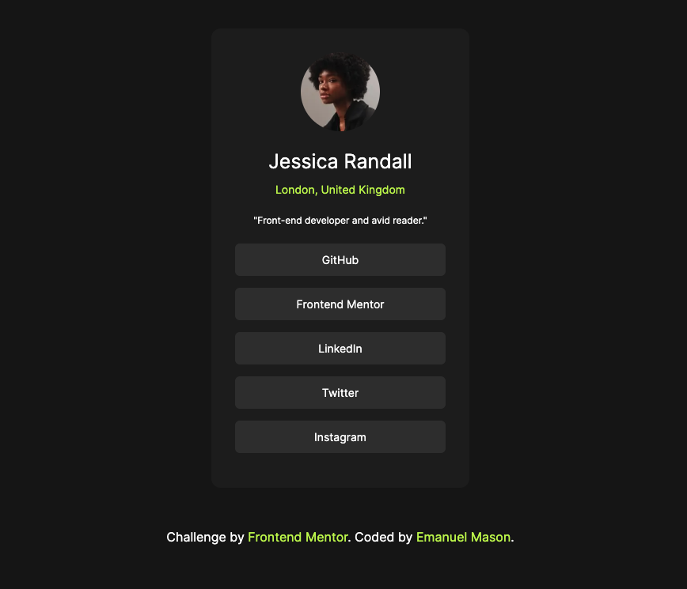
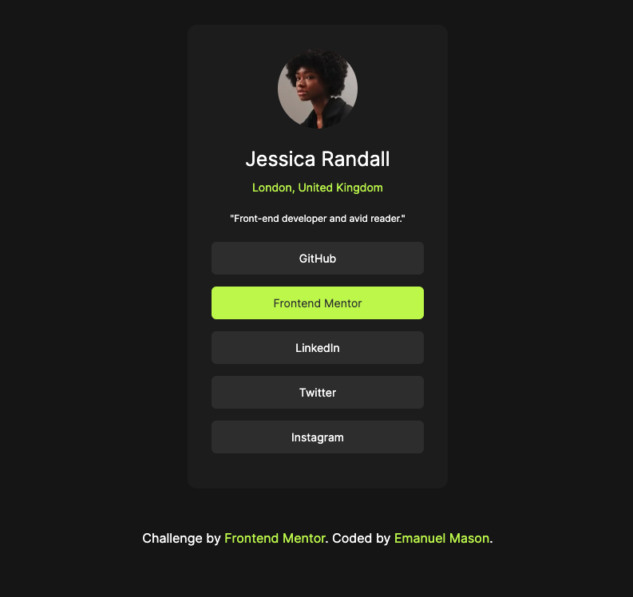
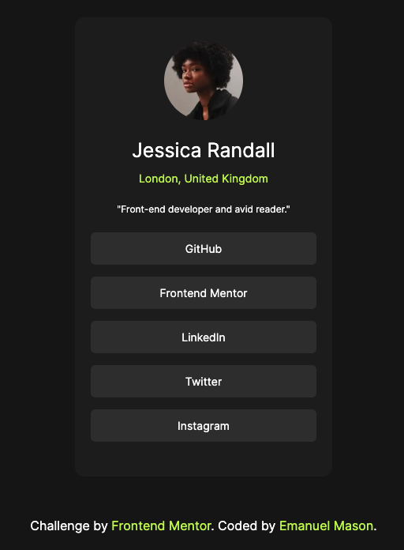

# Frontend Mentor - Social links profile solution

This is a solution to the [Social links profile challenge on Frontend Mentor](https://www.frontendmentor.io/challenges/social-links-profile-UG32l9m6dQ). Frontend Mentor challenges help you improve your coding skills by building realistic projects. 

## Table of contents

- [Overview](#overview)
  - [The challenge](#the-challenge)
  - [Screenshot](#screenshot)
  - [Links](#links)
- [My process](#my-process)
  - [Built with](#built-with)
- [Getting Started](getting-started)
- [Author](#author)

## Overview

### The challenge

Users should be able to:

- See hover and focus states for all interactive elements on the page

### Screenshot





### Links

- Live Site URL: [https://social-links-profile-theta-one.vercel.app/](https://social-links-profile-theta-one.vercel.app/)

## My process

### Built with

- Semantic HTML5 markup
- CSS custom properties
- Mobile-first workflow
- [Tailwindcss](https://tailwindcss.com/docs/box-shadow-color)
- [React](https://reactjs.org/) - JS library
- [Next.js](https://nextjs.org/) - React framework

## Getting Started

First, run the development server:

```bash
npm run dev
# or
yarn dev
# or
pnpm dev
# or
bun dev
```

Open [http://localhost:3000](http://localhost:3000) with your browser to see the result.

## Author

- Website - [Emanuel Mason](https://www.emamason.com)
- Frontend Mentor - [@emamasonn](https://www.frontendmentor.io/profile/emamasonn)


